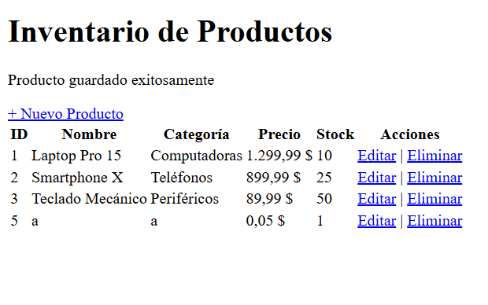
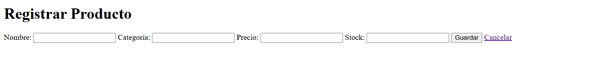

# MVC Productos - CRUD con Jakarta Servlet/JSP

## Descripcion del proyecto
Este proyecto implementa un sistema web de gestion de productos usando el patron MVC con Java.

- Backend: Jakarta Servlet
- Vista: JSP + JSTL
- Build: Maven
- Despliegue: WAR sobre Apache Tomcat 10

La aplicacion permite registrar, listar, editar y eliminar productos, mostrando mensajes de confirmacion y una vista de error personalizada.

## Prerrequisitos
Antes de ejecutar el proyecto, verifica tener instalado:

- Java JDK 17 o superior (se probo con JDK 21)
- Maven 3.8+ (o usar Maven Wrapper `mvnw`)
- Apache Tomcat 10.1+
- Git (opcional, para clonar repositorio)

## Instrucciones de ejecucion

### 1. Ubicarse en el proyecto
```powershell
cd mvc-productos
```

### 2. Compilar y generar el WAR
```powershell
.\mvnw.cmd clean package
```

### 3. Desplegar en Tomcat local
Copiar el WAR generado a la carpeta `webapps` de Tomcat y arrancar el servidor:

```powershell
$tomcat="C:\Users\sebas\develop\tomcat"
Copy-Item ".\target\mvc-productos-1.0-SNAPSHOT.war" "$tomcat\webapps\mvc-productos.war" -Force
& "$tomcat\bin\catalina.bat" run
```

### 4. Abrir en navegador
- Sistema: http://localhost:8080/mvc-productos/productos
- Prueba de error 404: http://localhost:8080/mvc-productos/no-existe

## Capturas

### Lista de productos


### Registrar producto


### Editar producto


## Funcionalidades implementadas

- Listado de productos en tabla con estilo por filas.
- Registro de nuevos productos mediante formulario.
- Edicion de productos existentes.
- Eliminacion de productos con confirmacion.
- Mensajes de exito al guardar, actualizar y eliminar.
- Vista de error personalizada para codigos 404 y 500.
- Redireccion inicial desde `index.jsp` al listado de productos.
